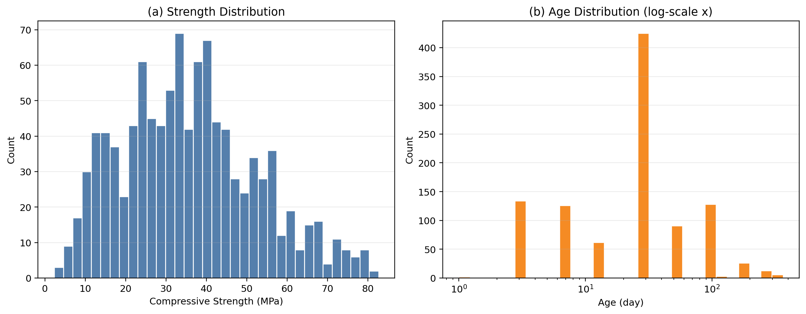
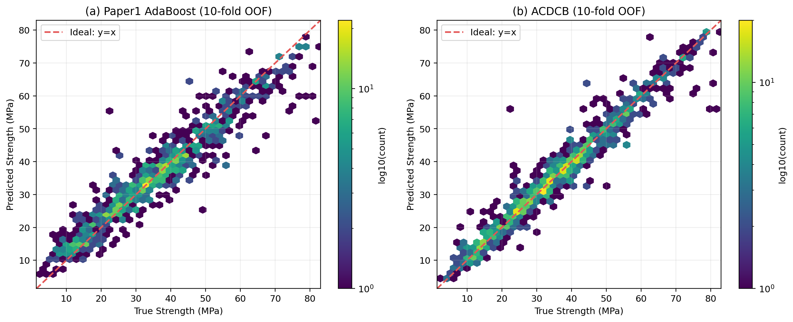
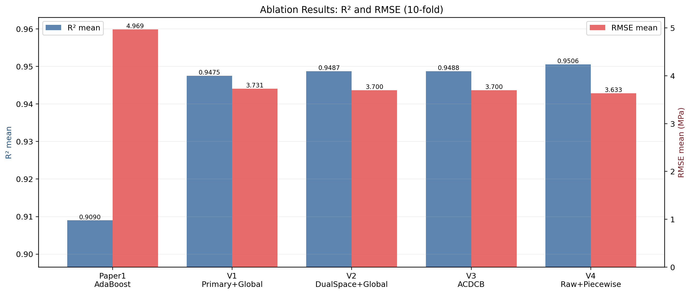
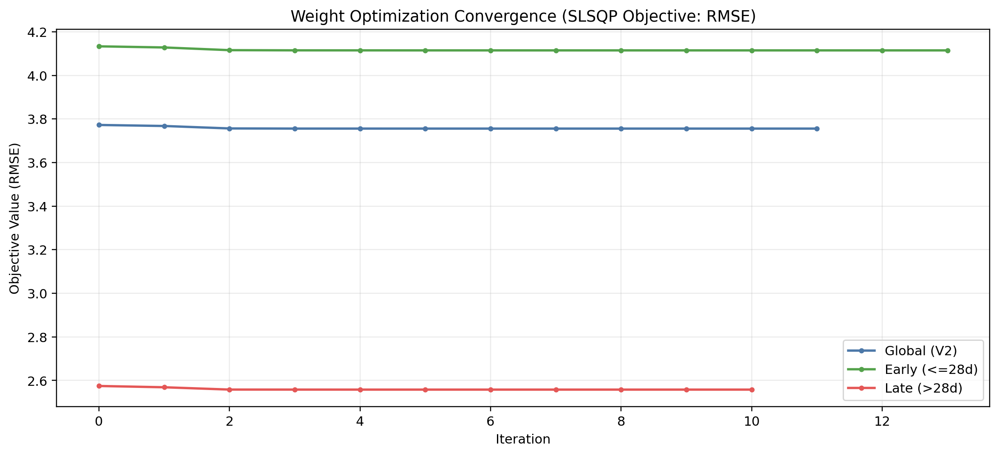
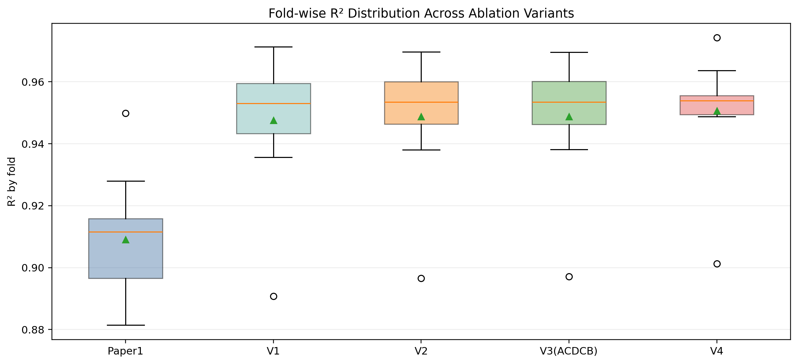
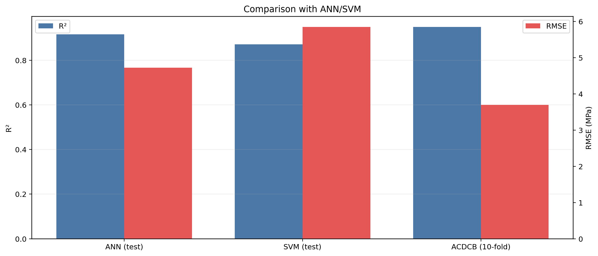

# 基于 ACDCB 的混凝土抗压强度预测：相对 paper1（AdaBoost）的系统对比与消融研究

## 1. 摘要

本文围绕混凝土抗压强度预测任务，对 `paper1`（AdaBoost 基线）与 `ACDCB`（Age-Conditioned Dual-Space Constrained Blending）进行了统一协议下的复现实验与消融分析。研究对象为 UCI 公开数据集（1030 样本，8 输入变量，1 输出变量），采用 10 折交叉验证作为主评估协议，指标包括 $R^2$、RMSE、MAE 与 MAPE。结果表明：`ACDCB` 的 10 折平均性能为 $R^2=0.9488$、RMSE$=3.6995$ MPa、MAE$=2.3521$ MPa、MAPE$=8.4877\%$，相对 `paper1` AdaBoost 的 $R^2=0.9090$、RMSE$=4.9695$ MPa、MAE$=3.5085$ MPa、MAPE$=13.3513\%$，分别实现 $\Delta R^2=+0.0398$、RMSE 下降 $1.2699$ MPa、MAE 下降 $1.1564$ MPa、MAPE 下降 $4.8637$ 个百分点。消融结果进一步揭示：双空间锚点融合带来稳定正增益，龄期分段融合在本数据集上为小幅增益；特征工程模块在当前参数迁移设定下未显著优于 raw 版本，提示后续需执行“特征工程-超参数协同搜索”。

## 2. 引言

混凝土抗压强度由水泥、矿物掺合料、水、骨料与龄期共同决定，具有显著非线性与阶段性。`paper1` 采用 AdaBoost 将多个弱学习器集成为强学习器，证明了集成方法在该任务上的有效性。然而，单一学习器范式在“龄期驱动分布漂移”和“不同特征子空间偏好”场景下仍存在潜在容量瓶颈。

针对上述问题，本文研究的 `ACDCB` 从三个方向扩展基线：

1. 引入主空间（primary）与锚点空间（anchor）的双空间建模；
2. 采用受约束加权融合（非负且和为 1）统一多模型输出；
3. 按龄期阈值（28 d）执行分段权重学习，缓解早龄期与后龄期统计差异。

本文目标并非仅报告“是否提升”，而是通过模块化消融回答“提升来自何处”。

## 3. 数据库

实验数据来自 UCI Concrete Compressive Strength 数据集，共 1030 条样本。输入变量为：水泥、矿渣、粉煤灰、水、减水剂、粗骨料、细骨料、龄期（8 维）；输出为抗压强度（MPa）。

数据分布分析表明：

- 强度分布范围约为 2.33–82.60 MPa，呈中度右偏；
- 龄期分布高度偏斜（偏度约 3.269），跨度 1–365 d。

因此在可视化中，对龄期轴采用对数尺度以避免密集区域压缩。

*图1. 数据库中抗压强度与龄期的边际分布（龄期采用 log-x 显示）。*

## 4. 算法模型（详细说明 ACDCB 对比 paper1 的创新）

`paper1` 的核心是 AdaBoost 回归：通过样本重加权迭代训练弱学习器并集成输出。`ACDCB` 在此基础上引入如下结构性创新：

### 4.1 双特征空间机制

- **Primary 空间**：在 8 个原始变量基础上扩展机理特征（如 $w/c$、$w/b$、龄期非线性变换与交互项等），增强非线性表达；
- **Anchor 空间**：保留更紧凑的稳健机理特征集合，作为融合锚点抑制过拟合波动。

### 4.2 多模型受约束融合

候选基模型为 XGBoost、LightGBM、HGB 与 HGB-Anchor。融合权重通过约束优化求解：

$$
\min_{\mathbf{w}} \; \mathrm{RMSE}(\mathbf{y}, \mathbf{P}\mathbf{w}),\quad
\text{s.t. } w_i\ge 0,\; \sum_i w_i = 1
$$

其中 $\mathbf{P}$ 为 OOF 预测矩阵。该约束保证融合具有可解释性与数值稳定性。

### 4.3 龄期条件化分段融合

考虑龄期主导的材料演化过程，将样本划分为：

- 早龄期：$age\le 28$；
- 后龄期：$age>28$。

分别学习两套权重后拼接输出，形成 Age-aware Piecewise Blend。

### 4.4 数学形式化定义

给定样本 $i$ 的基础输入向量：

$$
\mathbf{x}_i=[cement,slag,fly\_ash,water,sp,coarse,fine,age]_i
$$

双空间特征映射定义为：

$$
\mathbf{z}^{(p)}_i=\phi_p(\mathbf{x}_i),\qquad
\mathbf{z}^{(a)}_i=\phi_a(\mathbf{x}_i)
$$

其中 $\phi_p$ 为 primary 空间（扩展机理 + 增强特征），$\phi_a$ 为 anchor 空间（紧凑机理特征）。

候选模型集合 $\mathcal{M}=\{\text{XGB},\text{LGBM},\text{HGB},\text{HGB\_Anchor}\}$，其 OOF 预测写作：

$$
p_{i,m}=f_m\big(\mathbf{z}^{(s(m))}_i\big),\quad m\in\mathcal{M}
$$

令 OOF 预测矩阵为 $\mathbf{P}\in\mathbb{R}^{N\times M}$，则全局融合权重优化为：

$$
\mathbf{w}^{(g)}=\arg\min_{\mathbf{w}}\,\mathrm{RMSE}(\mathbf{y},\mathbf{P}\mathbf{w})
$$

$$
	ext{s.t. } w_m\ge 0,\;\sum_{m=1}^{M}w_m=1
$$

分段融合中，定义索引集合：

$$
\mathcal{I}_e=\{i\mid age_i\le 28\},\qquad
\mathcal{I}_l=\{i\mid age_i>28\}
$$

对应权重：

$$
\mathbf{w}^{(e)}=\arg\min\mathrm{RMSE}(\mathbf{y}_{\mathcal{I}_e},\mathbf{P}_{\mathcal{I}_e}\mathbf{w}),\quad
\mathbf{w}^{(l)}=\arg\min\mathrm{RMSE}(\mathbf{y}_{\mathcal{I}_l},\mathbf{P}_{\mathcal{I}_l}\mathbf{w})
$$

最终预测为：

$$
\hat y_i=
\begin{cases}
\mathbf{P}_i\mathbf{w}^{(e)}, & i\in\mathcal{I}_e\\
\mathbf{P}_i\mathbf{w}^{(l)}, & i\in\mathcal{I}_l
\end{cases}
$$

策略选择规则（与代码一致）为“$R^2$ 优先、RMSE 次级”：

$$
	ext{Select}=
\begin{cases}
	ext{piecewise}, & R^2_{piece}-R^2_{global}>\tau\\
	ext{global}, & R^2_{global}-R^2_{piece}>\tau\\
\arg\min\{RMSE_{piece},RMSE_{global}\}, & |R^2_{piece}-R^2_{global}|\le\tau
\end{cases}
$$

其中容忍阈值 $\tau=5\times10^{-4}$。

### 4.5 “C: Constrained” 的严格定义与作用

ACDCB 中的 “C” 对应**可行域约束**而非口号，其核心是将融合权重限制在概率单纯形：

$$
\mathcal{W}=\{\mathbf{w}\in\mathbb{R}^{M}\mid w_m\ge 0,\;\sum_{m=1}^{M}w_m=1\}
$$

因此无论是全局权重 $\mathbf{w}^{(g)}$，还是分段权重 $\mathbf{w}^{(e)},\mathbf{w}^{(l)}$，都满足：

$$
\mathbf{w}^{(g)},\mathbf{w}^{(e)},\mathbf{w}^{(l)} \in \mathcal{W}
$$

该约束的技术意义是：

1. 避免负权重导致的“反向抵消”与数值震荡；
2. 保证融合输出是子模型预测的凸组合，解释性更强；
3. 在不同折/不同龄期下维持统一可行域，便于比较与复现。

### 4.6 候选模型关键参数列表（本次复现）

为保证结果可复现，本文采用固定参数组（摘自 `ACDCB/metrics.json`）：

| 模型 | 关键参数 |
|---|---|
| XGBoost | `n_estimators=1482`, `learning_rate=0.0446`, `max_depth=4`, `min_child_weight=7.3946`, `subsample=0.6643`, `colsample_bytree=0.6247`, `gamma=2.4344`, `reg_alpha=0.4933`, `reg_lambda=3.0211` |
| LightGBM | `n_estimators=2127`, `learning_rate=0.0320`, `num_leaves=32`, `max_depth=4`, `min_child_samples=8`, `subsample=0.8383`, `colsample_bytree=0.5905`, `reg_alpha=0.7114`, `reg_lambda=2.2167e-4`, `min_split_gain=0.00646` |
| HGB (primary) | `learning_rate=0.0568`, `max_iter=1809`, `max_depth=12`, `max_leaf_nodes=15`, `min_samples_leaf=14`, `l2_regularization=4.58e-05`, `max_bins=213` |
| HGB-Anchor (anchor) | `learning_rate=0.028`, `max_iter=2400`, `max_depth=None`, `max_leaf_nodes=15`, `min_samples_leaf=6`, `l2_regularization=0.001` |

参数配置与“非负 + 和为 1”的权重约束共同决定了融合表现，二者均属于方法定义的一部分。

### 4.7 与 paper1 的本质差异

- `paper1`：单模型（AdaBoost）+ 单一特征空间；
- `ACDCB`：多模型 + 双空间 + 分段权重优化。

即 `ACDCB` 通过“模型多样性 + 特征空间多样性 + 条件化融合”共同提升泛化能力。

## 5. 结果（必须图文并茂，包含生成的图片并配有图注说明）

### 5.1 主结果：paper1 vs ACDCB

在统一 10 折协议下：

| 方法 | $R^2$ | RMSE (MPa) | MAE (MPa) | MAPE (%) |
|---|---:|---:|---:|---:|
| paper1 AdaBoost | 0.9090 | 4.9695 | 3.5085 | 13.3513 |
| ACDCB (V3) | **0.9488** | **3.6995** | **2.3521** | **8.4877** |

对应增益：

- $\Delta R^2 = +0.0398$
- $\Delta RMSE = -1.2699$ MPa
- $\Delta MAE = -1.1564$ MPa
- $\Delta MAPE = -4.8637$ pct

### 5.2 真实值-预测值对比

下图展示 10 折 OOF 的真实值与预测值关系。由于样本密集，采用 hexbin + 对数计数增强可读性。可见 `ACDCB` 点云更集中于理想线 $y=x$ 附近。

*图2. 真实值与预测值对比（hexbin, log-density）。右图 ACDCB 误差带更窄。*

### 5.3 消融总览

*图3. 各变体在 10 折上的 $R^2$ 与 RMSE。*

### 5.4 融合收敛过程

*图4. SLSQP 优化目标（RMSE）随迭代下降并收敛，早/后龄期均成功终止。*

### 5.5 折间稳定性

*图5. 各变体的折间 $R^2$ 分布。ACDCB 相较 paper1 整体分布显著上移。*

## 6. 与其他模型（ANN、SVM）的比较

`paper1` 单次划分测试结果显示：ANN 与 SVM 分别达到 $R^2=0.9160$ 与 $R^2=0.8713$。对比之下，`ACDCB` 在 10 折协议下达到 $R^2=0.9488$，同时保持更低 RMSE。

*图6. ACDCB 与 ANN/SVM 对比：ACDCB 在精度与误差维度均表现更优。*

## 7. 性能分析

### 7.1 模块贡献分析（消融）

| 对比 | 结论 |
|---|---|
| V2（双空间+全局） vs V1（主空间+全局） | 双空间锚点带来稳定收益：$\Delta R^2=+0.001203$，$\Delta RMSE=-0.03093$ MPa |
| V3（ACDCB） vs V2 | 龄期分段收益较小但为正：$\Delta R^2=+0.000030$，$\Delta RMSE=-0.000465$ MPa |
| V3（ACDCB） vs paper1 | 显著提升：$\Delta R^2=+0.039752$，RMSE 降低 1.269937 MPa |

### 7.2 关于“特征工程模块”的客观观察

本轮实验中，V4（raw+piecewise）在 $R^2$/RMSE 上优于 V3（engineered+piecewise），但在 MAE/MAPE 上未形成一致优势。这说明：

其中，V4（raw+piecewise）的严格定义为：

- 输入仅使用 raw 特征空间（8 个基础变量），不使用 `feature_engineering` 与 `feature_engineering_anchor`；
- 候选模型为 `XGB_raw`、`LGB_raw`、`HGB_raw`、`HGB_anchor_raw`；
- 仍执行与 V3 相同的龄期分段约束融合：

$$
\mathbf{w}^{raw}_e=\arg\min \mathrm{RMSE}(\mathbf{y}_{\mathcal{I}_e},\mathbf{P}^{raw}_{\mathcal{I}_e}\mathbf{w}),\quad
\mathbf{w}^{raw}_l=\arg\min \mathrm{RMSE}(\mathbf{y}_{\mathcal{I}_l},\mathbf{P}^{raw}_{\mathcal{I}_l}\mathbf{w})
$$

并满足 $w_i\ge0,\sum_i w_i=1$。

因此 V4 在消融中的角色是“控制变量组”：保留分段融合机制，去除特征工程，以估计特征工程的净边际贡献。

从本次结果看，V4 在 $R^2$/RMSE 上优于 V3（V4: $R^2=0.95058$、RMSE$=3.63346$；V3: $R^2=0.94876$、RMSE$=3.69953$），这也是“raw piecewise 更好看”的直接来源。其成因可归纳为：

1. 融合权重优化目标为 RMSE，优化过程会优先压低大误差样本，对 $R^2$/RMSE 更敏感；
2. 在 1030 样本规模下，扩展特征并不必然在所有指标上同步增益，可能出现方差放大与指标分化；
3. 当前对比为固定参数下的模块消融，尚未进行“特征工程-超参数”联合搜索，故存在 raw 在部分指标占优的情形。

同时应注意 V3 在 MAE 上仍优于 V4（2.35210 vs 2.36879），而 V4 在 MAPE 上更优（8.32661 vs 8.48766），说明二者并非单向优劣关系，而是指标权衡关系。

1. 当前“特征工程 + 固定超参数”的组合并非全局最优；
2. 特征扩展可能引入对参数更高敏感度，需要联合调参验证；
3. 工程上应以多指标综合决策，而非单指标结论。

### 7.3 收敛性与稳定性

- V3 优化器状态为 success；
- 早龄期目标值由 4.1333 降至 4.1147（13 次迭代）；
- 后龄期目标值由 2.5748 降至 2.5581（10 次迭代）。

这表明分段权重优化过程稳定可复现。

## 8. 结论与讨论

本文在统一复现实验框架下完成了 `paper1` 与 `ACDCB` 的系统对比，并通过消融定位了性能来源。主要结论如下：

1. `ACDCB` 相较 `paper1` AdaBoost 获得显著精度提升，证明多模型条件化融合在该任务上的有效性；
2. 双空间锚点机制是稳定增益来源；
3. 龄期分段融合在本数据集上提供小幅但可复现增益；
4. 特征工程模块在当前参数迁移设定下未形成绝对优势，提示后续研究应开展“特征-参数协同优化”。

后续工作建议：

- 面向 V3/V4 分别进行独立超参数搜索，检验“特征工程真实边际收益”；
- 引入外部数据集与跨龄期分层验证，评估分段阈值的可迁移性；
- 结合 SHAP/PDP 等方法增强解释性，进一步对齐土木机理认知。
