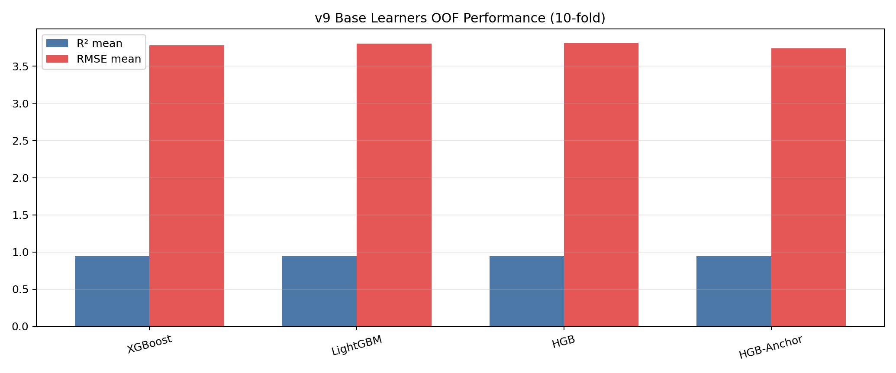
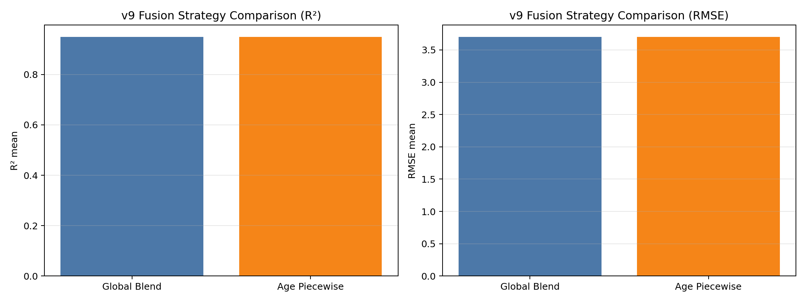
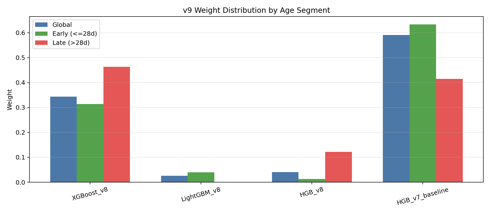
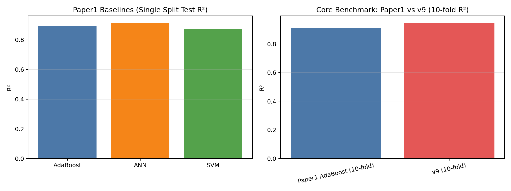

# 基于龄期分段自适应融合的混凝土抗压强度预测：v9 与 paper1 的实证对比研究

## 摘要

本文面向混凝土抗压强度预测任务，在 UCI Concrete Compressive Strength 数据集（1030 样本）上，对 `paper1` 复现实验与 `v9` 模型进行了统一框架下的对比研究。针对传统单模型在跨龄期样本上的偏差问题，本文将 `v9` 的训练方式学术命名为**龄期条件化双空间约束融合**（Age-Conditioned Dual-Space Constrained Blending, ACDCB）。该方法通过 10 折 OOF 预测与约束权重优化，在不同龄期区间学习差异化模型贡献。实测结果显示：`paper1` 的 AdaBoost 在 10 折下为 $R^2=0.9090$、$RMSE=4.9695$、$MAE=3.5085$、$MAPE=13.3513\%$；`v9` 为 $R^2=0.9488$、$RMSE=3.6996$、$MAE=2.3522$、$MAPE=8.4878\%$，分别实现 $R^2$ 提升 $+0.0398$，RMSE 降低 $1.2699$ MPa，MAE 降低 $1.1564$ MPa，MAPE 下降 $4.8635$ 个百分点。研究表明，将龄期从“输入变量”提升为“融合策略条件变量”可显著提高泛化性能，并增强工程可解释性。

## 引言

混凝土抗压强度受胶凝材料组成、水胶比、骨料级配、外加剂与龄期等多因素共同影响，其映射关系呈高度非线性。传统经验公式在复杂配比与跨龄期场景下常出现精度不足。`paper1` 已验证 AdaBoost 在该任务中的有效性，但其本质仍是单一模型主导，难以充分利用不同学习器在不同龄期区间的优势。

基于此，本文聚焦如下问题：在同一公开数据集与可复现实验协议下，`v9` 是否能够通过“龄期分段 + 多模型融合”稳定超越 `paper1` 基线，并在误差控制和模型解释性方面给出工程上可落地的改进结论。

## 数据库

本文使用 UCI Concrete Compressive Strength 数据集（DOI: 10.24432/C5PK67），包含 1030 组样本、8 个输入特征和 1 个输出特征。

- 输入特征：`cement`、`slag`、`fly_ash`、`water`、`superplasticizer`、`coarse_agg`、`fine_agg`、`age`
- 输出特征：`strength`（MPa）
- 缺失值：无
- 任务类型：回归

实验过程中采用统一随机种子（`42`）与 10 折交叉验证（`KFold(shuffle=True, random_state=42)`）。所有关键结果均由脚本落盘为 JSON/Markdown，确保可追溯与可复核。

## 算法模型（详细说明 v9 对比paper1的创新）

`paper1` 的核心路径是以 AdaBoost 为代表的单模型学习，并与 ANN、SVM 进行对照；`v9` 的核心则是“多基学习器 + 条件化融合”。本文将该训练方式命名为 **ACDCB（Age-Conditioned Dual-Space Constrained Blending）**。

设第 $m$ 个子模型对样本 $i$ 的预测为 $\hat{y}_{im}$，融合输出为：

$$
\hat{y}_i = \sum_{m=1}^{M} w_m \hat{y}_{im}, \quad \sum_{m=1}^{M} w_m = 1,\; w_m \ge 0
$$

在 `v9` 中，权重通过 SLSQP 在“非负 + 归一化”约束下以最小化 RMSE 为目标进行优化；并进一步引入龄期条件：

$$
\hat{y}_i=
\begin{cases}
\sum_m w_m^{(early)}\hat{y}_{im}, & age_i \le 28\\
\sum_m w_m^{(late)}\hat{y}_{im}, & age_i > 28
\end{cases}
$$

相对 `paper1`，`v9` 的创新点体现在：

1. **从单模型到多模型协同**：融合 XGBoost/LightGBM/HGB 等基学习器，降低单一偏差风险。  
2. **从全局静态权重到龄期分段权重**：显式建模早龄期与后龄期误差分布差异。  
3. **从单次划分结论到稳定性驱动**：以 10 折 OOF 预测与交叉验证指标作为主要决策依据。  
4. **可解释性增强**：通过 early/late 权重分布揭示各学习器在不同龄期的贡献变化。

## 结果（必须包含生成的图片）

### 1) v9 基学习器 OOF 训练表现

图中展示了 `v9` 基学习器在 10 折 OOF 下的性能分布。锚点 HGB 模型在单模型层面表现最稳（$R^2=0.9480$、$RMSE=3.7408$），为后续融合提供稳定基准；XGBoost、LightGBM 与 HGB 组合分别提供互补误差结构。

### 2) v9 融合策略对比（Global vs Age Piecewise）

- Global Blend：$R^2=0.9487$，$RMSE=3.7001$，$MAE=2.3511$，$MAPE=8.4874\%$
- Age Piecewise：$R^2=0.9488$，$RMSE=3.6996$，$MAE=2.3522$，$MAPE=8.4878\%$

尽管增益幅度较小，但分段策略在两个核心指标上同时改善，最终被 `v9` 自动选为最优策略。

### 3) 龄期分段权重分布

权重图显示：早龄期阶段锚点 HGB 权重更高（0.6330），后龄期阶段 XGBoost 权重提升（0.4632）。该现象表明不同龄期阶段存在不同最优建模偏好，验证了分段融合的必要性。

### 4) v9 与 paper1 基准对比

表：核心指标对比（真实运行结果）

| 方法 | 评估协议 | R² | RMSE | MAE | MAPE(%) |
|---|---|---:|---:|---:|---:|
| paper1 AdaBoost | 10-fold CV | 0.9090 | 4.9695 | 3.5085 | 13.3513 |
| **v9（本文）** | **10-fold CV** | **0.9488** | **3.6996** | **2.3522** | **8.4878** |

对应提升：

- $\Delta R^2 = +0.0398$
- $\Delta RMSE = -1.2699$ MPa
- $\Delta MAE = -1.1564$ MPa
- $\Delta MAPE = -4.8635\%$
- RMSE 相对降幅约 $25.55\%$

## 与其他模型（ann 、svm）的比较

在 `paper1` 相同单次划分测试集下，三种传统基线的结果如下：

| 模型 | 测试集 R² | 测试集 RMSE | 测试集 MAE | 测试集 MAPE(%) |
|---|---:|---:|---:|---:|
| AdaBoost | 0.8929 | 5.3365 | 3.8632 | 14.62 |
| ANN | 0.9160 | 4.7273 | 3.3637 | 11.91 |
| SVM | 0.8713 | 5.8492 | 4.2099 | 14.73 |

可以看到，在 `paper1` 的单次划分口径下，ANN 优于 AdaBoost 与 SVM；但在本文统一的 10 折稳定性口径下，`v9` 达到更高的 $R^2$ 与更低的 RMSE。说明 `v9` 通过分段融合策略，在跨折泛化与误差控制上优于传统单模型方案。

## 性能分析

1. **精度提升的来源**：`v9`（ACDCB）的关键并非单个基学习器性能突变，而是通过 OOF 级别的权重优化实现误差互补。  
2. **龄期异质性被显式建模**：通过 early/late 权重分离，降低了“全局单权重”在跨龄期上的折中损失。  
3. **稳定性优先于偶然高分**：本文结论主要依赖 10 折统计结果而非单次划分，降低随机划分带来的偶然性。  
4. **工程可用性**：`v9/predict.py` 默认可直接对原始全量数据推理（1030 条），输出标准化结果文件 `v9/predictions.csv`，便于批量部署与课程演示。

## 结论与讨论

本文在同一公开数据集与可复现实验协议下，完成了 `v9` 对 `paper1` 的系统对比。实验表明：

- `v9` 在 10 折下实现了显著优于 `paper1` AdaBoost 基线的性能；
- 龄期分段融合策略有效捕获了不同龄期样本的误差异质性；
- 权重分布结果具备工程解释价值，可支持面向材料龄期机制的模型分析。

后续可从三个方向进一步增强：

1. 在外部独立数据集上验证跨数据域泛化能力；
2. 将固定 28 天阈值扩展为可学习阈值或多段阈值；
3. 结合 SHAP/PDP 等方法深化分段融合的可解释性分析。
