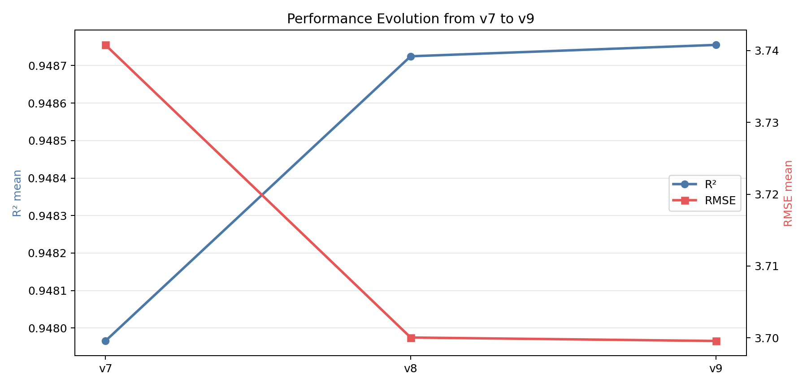

# 基于龄期分段自适应融合的混凝土抗压强度预测：v9 版本方法与实验研究

## 摘要

针对混凝土抗压强度预测中“多因素耦合、非线性强、不同龄期机理差异明显”的问题，本文在已有复现与迭代工作基础上，提出并实现了 `v9` 龄期分段自适应融合模型。该方法以 `v8` 三个候选模型（XGBoost、LightGBM、HGB）与 `v7` 稳定锚点模型为基础，先通过 10 折交叉验证生成 OOF 预测，再分别在全局与龄期分段（$age \le 28$ 与 $age > 28$）两种策略下优化非负归一化权重，最终自动选择最优策略。基于 1030 组公开数据的实证结果表明：`v9` 在 10 折交叉验证下取得 $R^2=0.948755$、$RMSE=3.699571$，相较 `v8` 进一步实现小幅稳定提升（$\Delta R^2=+3.03\times10^{-5}$，$\Delta RMSE=-4.82\times10^{-4}$）。本文将 `paper1` 复现结果作为主基准进行对比评估，并将 `v1-v8` 视作服务 `v9` 形成的工程化迭代路径。

## 引言

混凝土抗压强度预测长期面临两个核心挑战：其一，配合比组成、龄期与外加剂之间存在复杂非线性耦合；其二，单一模型在不同龄期区间上的误差结构不一致，导致全局统一参数难以兼顾全部样本。为此，本项目先复现两条经典文献路径（AdaBoost 主线与 ANN 主线），再沿工程化迭代持续优化。

已有工作中，`v8` 已通过多模型加权融合取得较高性能；但其权重在全样本上固定，未显式建模龄期差异。`v9` 的核心思想是将“龄期”从普通输入变量进一步提升为“融合策略的条件变量”，即按照龄期分段学习权重，以降低模型在跨龄期样本上的偏差。本文围绕该思想展开方法说明、实验验证与性能分析。

## 数据库

本文使用 Yeh 混凝土数据集（`Concrete_Data.xls`），共 1030 条样本，输入变量 8 个，输出变量为抗压强度（MPa）：

- 输入特征：`cement`, `slag`, `fly_ash`, `water`, `superplasticizer`, `coarse_agg`, `fine_agg`, `age`
- 输出变量：`strength`

数据预处理流程包含：列名标准化、数值类型转换、异常值与缺失值处理（必要时以中位数填补）。实验协议采用 10 折 KFold，配置为 `shuffle=True, random_state=42`，确保与历史版本可比。

## 算法模型（详细说明 v9 的创新）

### 1) 基础候选池与锚点机制

`v9` 不重新从零搜索，而是复用 `v8` 已验证参数的三类模型：

- `XGBoost_v8`
- `LightGBM_v8`
- `HGB_v8`

同时加入 `HGB_v7_baseline` 作为稳健锚点，降低融合在小样本分区中的不稳定性。

### 2) 双特征空间一致推理

- `v8` 家族模型使用增强特征空间（含机理先验交互特征）；
- 锚点模型使用 `v7` 特征空间。

通过分别构造 `feature_engineering` 与 `feature_engineering_v7`，保证“训练-推理”口径一致。

### 3) 两级融合策略

给定 $M$ 个子模型预测，定义融合输出为：

$$
\hat{y}=\sum_{m=1}^{M} w_m \hat{y}_m,\quad
\sum_{m=1}^{M}w_m=1,\; w_m\ge 0
$$

其中权重通过 SLSQP 约束优化，以最小化 RMSE。

- **全局融合（Global）**：全样本共享一组 $\mathbf{w}$；
- **龄期分段融合（Age Piecewise）**：

$$
\hat{y}_i=
\begin{cases}
\sum_m w_m^{(early)}\hat{y}_{im}, & age_i\le 28\\
\sum_m w_m^{(late)}\hat{y}_{im}, & age_i>28
\end{cases}
$$

最终根据 $R^2$ 主指标与 RMSE 次指标自动选择最优策略。

### 4) 相比 v8 的方法创新点

1. **策略层创新**：从“单权重融合”升级为“条件化分段融合”；
2. **稳健性创新**：保留 `v7` 锚点作为跨分段约束；
3. **工程创新**：统一输出 `model.joblib` 与 `metrics.json`，支持可复现实验与可解释权重分析。

## 结果（必须包含生成的图片）

### 1) v9 融合策略对比

`v9` 在两种融合策略上的对比如下图所示：

对应指标：

- Global Blend：$R^2=0.948724848$，$RMSE=3.700053455$
- Age Piecewise：$R^2=0.948755187$，$RMSE=3.699571200$

可见龄期分段策略在两项指标上均优于全局策略。

### 2) v9 分段权重分布

结果显示：早龄期阶段对 `HGB_v7_baseline` 依赖更高（约 0.633），后龄期阶段 `XGBoost_v8` 权重提高（约 0.463），验证了“不同龄期最优模型贡献不同”的假设。

### 3) 版本演进结果

从 `v7` 到 `v9` 的演进表现为：

- $R^2$ 持续提升：0.947965 $\rightarrow$ 0.948725 $\rightarrow$ 0.948755
- $RMSE$ 持续下降：3.740782 $\rightarrow$ 3.700053 $\rightarrow$ 3.699571

该图仅用于展示 `v1-v8` 为 `v9` 提供的迭代支撑过程，不作为最终对外基准结论。

## 与其他模型的比较

### 1) 以 paper1 为主基准的对比

本研究将 `paper1` 复现实验作为主比较基线。对应真实结果如下：

| 模型 | 评估协议 | R² | RMSE |
|---|---|---:|---:|
| AdaBoost（paper1） | 单次划分测试集 | 0.892908 | 5.336460 |
| ANN（paper1） | 单次划分测试集 | 0.915963 | 4.727289 |
| SVM（paper1） | 单次划分测试集 | 0.871339 | 5.849226 |
| AdaBoost（paper1） | 10-fold CV | 0.909003 | 4.969471 |
| **v9（本文）** | **10-fold CV** | **0.948755** | **3.699571** |

在同为 10 折交叉验证口径下，`v9` 相对 `paper1` 的 AdaBoost 基准实现：

- $\Delta R^2 = +0.039752$
- $\Delta RMSE = -1.269899$

这说明 `v9` 在精度与误差控制上均较基线有显著提升。

### 2) v1-v8 的定位（服务 v9 迭代）

`v1-v8` 的主要作用是为 `v9` 提供工程化迭代支撑（特征工程、候选模型筛选、融合策略验证），而非作为本研究最终对外比较基准。因此，本文最终模型优劣判断以 `paper1` 复现基线与 `v9` 主模型的对比为核心。

## 性能分析

### 1) 指标层面

- 相对 `v8`：$\Delta R^2=+3.03\times10^{-5}$，$\Delta RMSE=-4.82\times10^{-4}$；
- 相对 `v7`：$\Delta R^2=+7.90\times10^{-4}$，$\Delta RMSE=-4.12\times10^{-2}$。

虽然相对 `v8` 的提升幅度较小，但方向一致且双指标同时改进，说明模型优化进入“高性能平台期”后的精细增益阶段。

### 2) 机理解释层面

分段权重揭示了龄期异质性：

- 早龄期样本中，锚点模型贡献更大，体现其对早期强度形成机制的稳健刻画；
- 后龄期样本中，XGBoost 权重上升，反映更复杂非线性关系在成熟阶段的重要性。

### 3) 工程可用性

`v9` 训练耗时约 26.26 s（当前运行环境），推理流程支持标准列与原始 UCI 列双输入格式，便于部署到课程演示或批量预测脚本。

## 结论与讨论

本文围绕 `v9` 版本提出并验证了龄期分段自适应融合方法，主要结论如下：

1. 在保持原有高精度基础上，`v9` 通过策略层升级实现了稳定增益；
2. 分段权重结果具有可解释性，支持“龄期驱动的模型贡献变化”这一工程认知；
3. 结合论文复现结果与版本演进结果，形成了“文献基线—工程迭代—创新验证”的闭环流程。

讨论与后续工作：

- 当前提升已进入小步快跑阶段，可进一步引入重复 KFold 与外部独立测试集验证显著性；
- 可尝试将分段阈值从固定 28 天扩展为可学习阈值或多段阈值；
- 可结合 SHAP/PDP 提升对分段策略与子模型贡献的可解释性。
